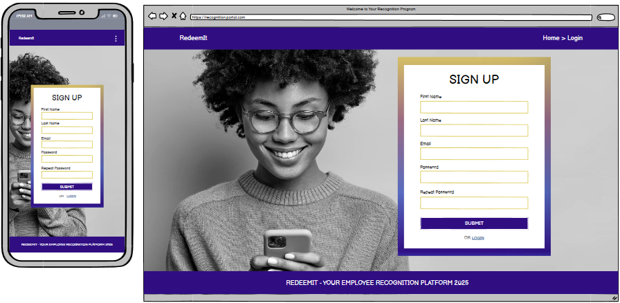
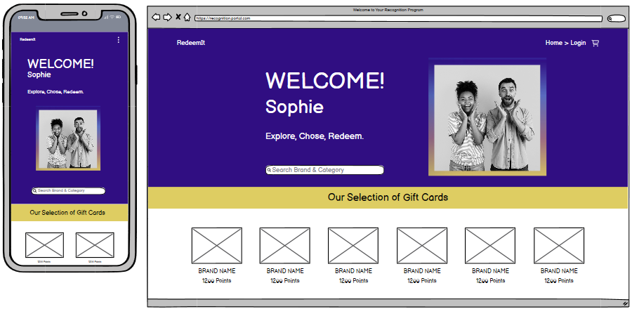
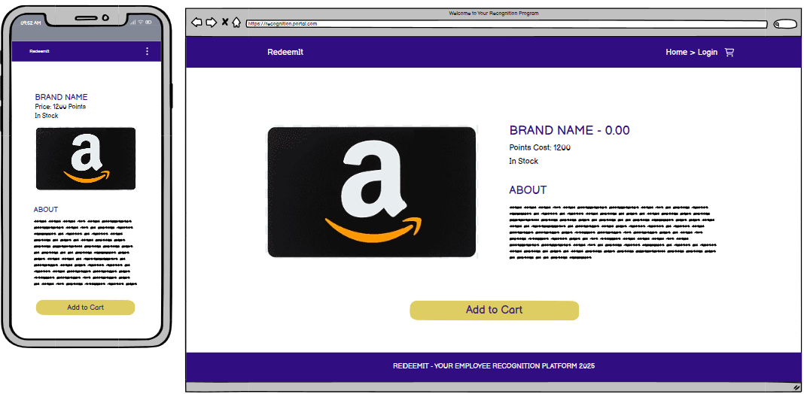

# RedeemIt - Your Employee Recognition Platform

## Table of Contents

- [Introduction](#introduction)
- [Key Features](#key-features)
- [User Experience](#user-experience)
  - [Wireframes](#wireframes)
  - [Typography & Colours](#typography--colours)
- [Project Planning](#project-planning)
  - [User Stories](#user-stories)
  - [Flowchart](#flowchart)
  - [Agile Planning](#agile-planning)
  - [Features in Detail](#features-in-detail)
- [Database Design](#database-design)
- [Technology](#technology)
  - [Tools Used](#tools-used)
- [Testing](#testing)
  - [Fixed Bugs](#fixed-bugs)
- [Deployment](#deployment)
- [Forking and Cloning](#forking-and-cloning)
- [Credits](#credits)

## Introduction

The [RedeemIt](https://redemption-website-ec86c7604627.herokuapp.com/) platform is a mock website inspired by the real-life platform used by employees at [Workhuman](https://www.workhuman.com). The platform allows employees to view their points balance, browse the gift card catalogue, and redeem their points.
In this project, admin functionality includes managing the catalogue (and updating employees' points balances? TO CONFIRM!!).
This project is a simplified version of the actual system, designed for learning and portfolio purposes, showcasing full-stack development skills using Django framework.

---

## Key Features

### Admin Access
- **Manage Catalogue**
  Admins can keep the reward catalogue up to date by:
  - Adding new gift card.
  - Editing details of existing gift card (e.g., name, points required, description, terms and conditions).
  - Removing gift card.

- **Manage User's Points Balance - TO CONFIRM!!**
  Admins can update and manage employees' reward points.

### Employee Access
- **Employee Login & Logout**
  Secure functionalities for employees to log in and out of their accounts.

- **Browse Available Rewards**
  View the catalogue to explore available gift cards.

- **Redemption**
  Employees can seamlessly redeem their points by:
  - Selecting gift card to add to their cart.
  - Viewing and reviewing their cart.
  - Modifying items in the cart if necessary.
  - Finalising the redemption process.

- **View User Profile Details - TO CONFIRM!!**
  Employees can view their personal details, including their reward points balance.

## User Experience

The user experience focuses on creating a seamless, intuitive interface for both employees and administrators. The platform aims to simplify navigation, reduce friction during interactions, and ensure tasks are completed efficiently.

### Wireframes
Wireframes were designed to outline the layout and functionality of each page and to help visualise the user flow. This ensures the platform’s structure is logical, responsive, and user-friendly. 
 was utilised to craft the detailed wireframes. These initial sketches served as the foundation for the app’s final structure and layout.

#### Login Page

  
Click to view the Login Page wireframe

  

#### Redemption Platform (Catalogue Home page)

  
Click to view the Redemption Platform wireframe

  

#### Gift Card Details Page

  
Click to view the Gift Card Details Page wireframe

  

### Typography & Colours
For this project, I aimed to offer a fresh and distinct version of the existing platform while keeping the functionalities simple and user-friendly. To maintain a connection to the company’s identity, I incorporated branding colours from the Workhuman website to reflect the style and spirit of the company. 
The colour palette also draws inspiration from the tech industry and current design trends, creating a clean, professional, and modern aesthetic. The chosen typography ensures readability and enhances the overall user experience, while the colour scheme provides a visually appealing and accessible interface.

#### Colour Scheme
The chosen colour palette draws inspiration from **Workhuman**'s branding and aligns with a modern, tech-inspired aesthetic.

| **Colour** | **Name**             |  
|------------|----------------------|  
| #300E82  | Persian Indigo       |
| #586BBE  | Savoy Blue           |
| #9B6B82  | Mountbatten Pink     |
| #DECD62  | Citron               |
| #484848  | Davy's Grey          |

 

  
Click to view inspiration from Workhuman website

  

  
Click to view inspiration from Unlocking Colour Communication

  

---

#### Typography
To ensure readability and maintain a clean, modern look, the following fonts were chosen:

- **Primary Font**: *Montserrat*
  - Used for headings and branding elements.
- **Secondary Font**: *Poppins*
  - Applied to body text for improved readability.
- **Accent Font**: *Quicksand*
  - Used for decorative or smaller UI elements, providing a modern, clean finish.

## Project Planning

### User Stories
The project is built around a series of user stories to address the needs of both employees and admin.
These stories define the core functionality, ensuring the platform meets user expectations while offering a clear workflow.

#### EPIC - Admin Access
1. **Add New Reward** *(must have)*
   Admins can add new items to the reward catalogue, including details like name, description, points required, etc...

2. **Edit Existing Reward** *(should have)*
   Admins can modify details of existing gift card, such as updating the item name, description, or point value.

3. **Delete Reward** *(should have)*
   Admins can remove gift card from the catalogue to keep the list up-to-date and relevant.

4. **Manage User's Points Balance** *(should have)*
   Admins can view and update the points balance for individual employees, ensuring accurate tracking of rewards.

---

#### EPIC - Employee Access
1. **Employee Login** *(must have)*
   Provides secure login functionality for employees to access the redemption platform.

2. **Employee Logout** *(must have)*
   Allows employees to securely log out of their session once they are done using the platform.

3. **Site User View Profile Details** *(could have)*
   Employees can view their profile details, including their current reward points balance and basic personal information.

---

#### EPIC - Redemption Process
1. **Browse Available Gift Card** *(must have)*
   Employees can view the full list of available gift card.

2. **Access Detailed Page** *(should have)*
   Employees can view detailed information about a specific gift card, including its description and points required.

3. **Add Gift Card to Cart** *(must have)*
    Employees can add gift card to their cart before proceeding to redeem.

4. **View Cart** *(must have)*
    Employees can review the list of gift card added to their cart, including the total points required.

5. **Modify Cart** *(should have)*
    Employees can update or remove items from their cart before finalising the redemption.

6. **Redeem Items** *(must have)*
    Employees can finalise the redemption process, confirming their selected gift cards and updating their points balance.

### Flowchart
The following flowchart illustrates the user journey for both **employees** and **admin users**. It maps out the key actions they can perform, such as logging in, redeeming rewards, and managing the catalogue. 
It was created using [Lucidchart](https://www.lucidchart.com/pages/).

  
Click to view Flowchart

  

### Agile Planning
The development process followed an agile methodology, breaking the project into smaller user stories and tasks. This iterative approach allowed for incremental progress, flexibility, and better alignment with user needs.

### Features in Detail
The platform offers a variety of features based on user stories, providing functionalities such as secure login, reward catalogue management, and a streamlined redemption process.

---

### Database Design  

The database was designed to allow full **CRUD functionality** for both **employees** and **admin users**.

- **Users**
  Employees can **register**, **log in**, and manage their profiles - TO CONFIRM!!, enabling the creation and updating of personal information in the `Employee` table.

- **Catalogue Management**
  Admins can **add**, **edit**, and **delete** items in the reward catalogue. Each item includes details such as the reward name, description, required points. This data is stored in the `Catalogue` table.

- **Redemptions**
  Employees can **view** available rewards, add them to their cart, and **finalise** the redemption process. The `Transaction` table tracks redemptions, including reward ID, user ID, and redemption date.

---

#### Entity Relationship Diagram

The **ERD** (Entity Relationship Diagram) was created using [Lucidchart](https://www.lucidchart.com/pages/) to visualise the database structure and relationships between tables.

---

## Technology

### Tools Used

---

## Testing

### Fixed Bugs

---

## Deployment

The site was deployed successfully to [Heroku](https://redemption-website-ec86c7604627.herokuapp.com/) following the steps below:

1.  
2.  
3.  
4.  
5.  

---

## Forking and Cloning

Forking the repository creates a copy of this project, allowing modifications without affecting the original code. Once the repository is forked, it can be cloned to a local machine for development. 
Follow these steps to fork, clone, and work on the project:

- **Fork the repository**
  - Go to the repository you want to fork on [GitHub](https://github.com/).
  - In the top-right corner of the page, click `Fork`.
  - Name the new forked repository, then click `Create Fork`.
  - This creates a copy of the repository under your own GitHub account.

- **Clone the forked repository**
  - In the forked repository on GitHub, above the list of files, click `Code`.
  - Copy the URL for the repository (either HTTPS or SSH).
  - Open a terminal (or Git Bash).
  - Type `git clone`, then paste the copied URL.
  - Press `Enter`.
  - Navigate to the newly cloned repository directory: `cd` and the repository name.

---

## Credits
